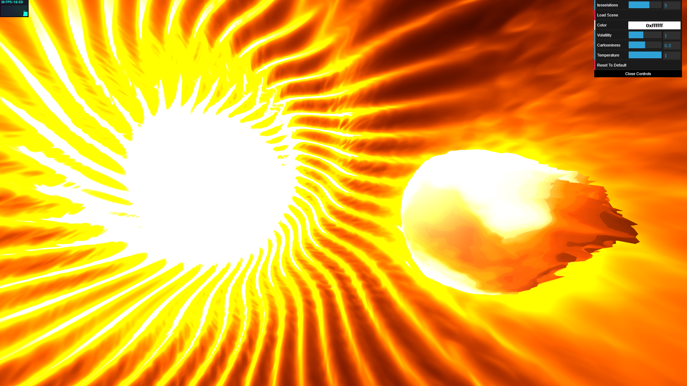
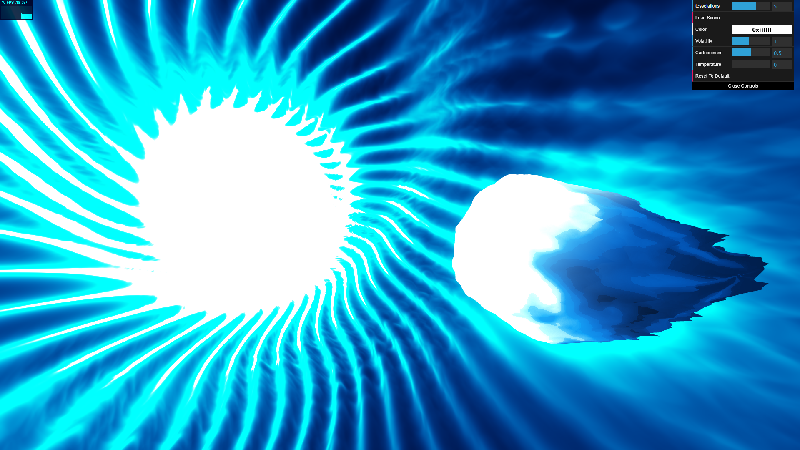

# [Project 1: Noise](https://github.com/CIS-566-Fall-2022/hw01-fireball-base)

Description
--------------------------
For the fireball, I distorted the vertices of a sphere with fbm and trig.  There are layers of distortion that go along the normal, along the y-axis, and along the normal projected on the xz plane.  In the fragment shader, I use the amount the vertex is distorted, along with additional fbm and trig noise, to determine the glow.  I also used a smoothstep so that the fireball gets brighter towards the base.  I also used a pulse effect so the fireball's brightness would flicker a bit.  I also have a posterize effect on the brightness of the fireball.

For the background, I used volumetric raymarching.  I made an SDF cylinder that has its radius oscillate with respect to the angle along the cylinder to create bright creases that look like fire.  I distorted the raymarch position and SDF samples with noise to make the background more firey.  I have a big light source in the middle of the tunnel and another light source on the fireball so it looks like it's glowing (but this light source is bugged in some perspectives). 

[Live Demo Link](https://aurcereal.github.io/hw01-fireball/)

Screenshots
--------------------------

